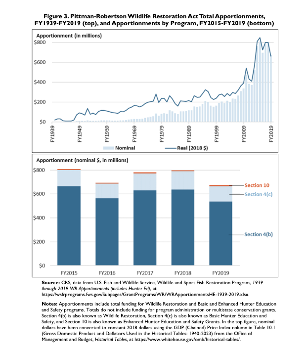
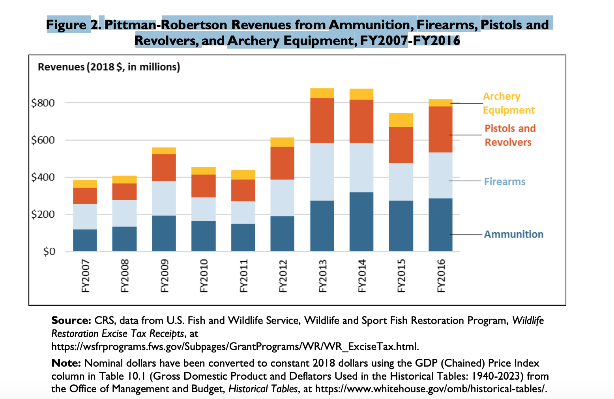
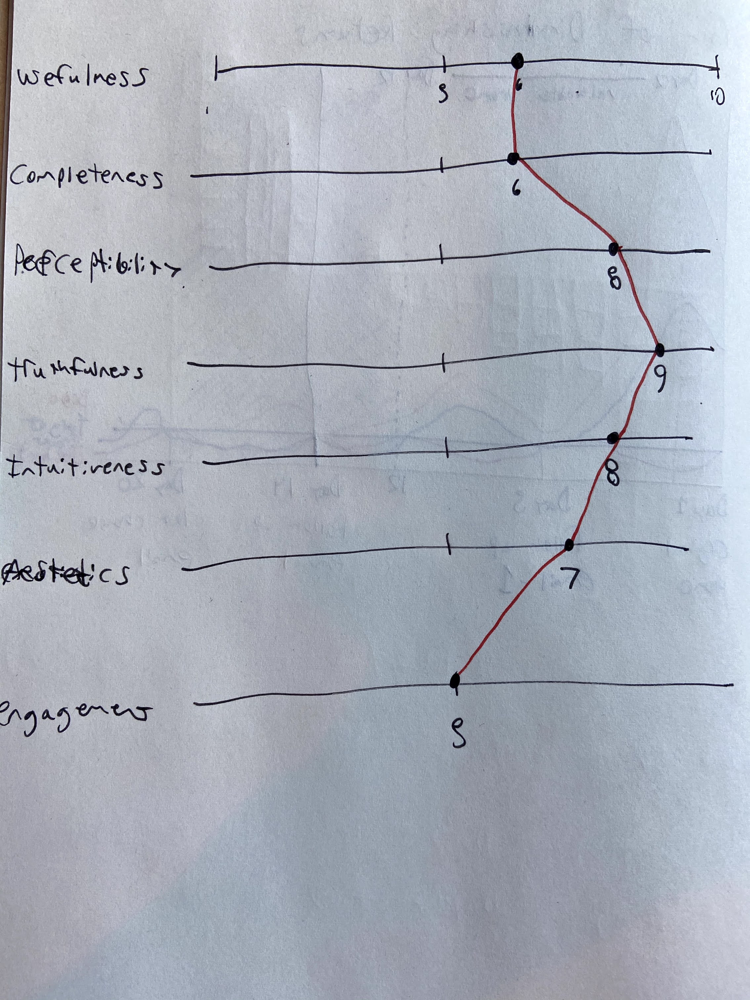
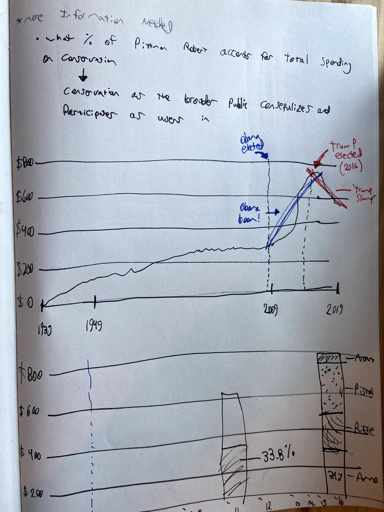
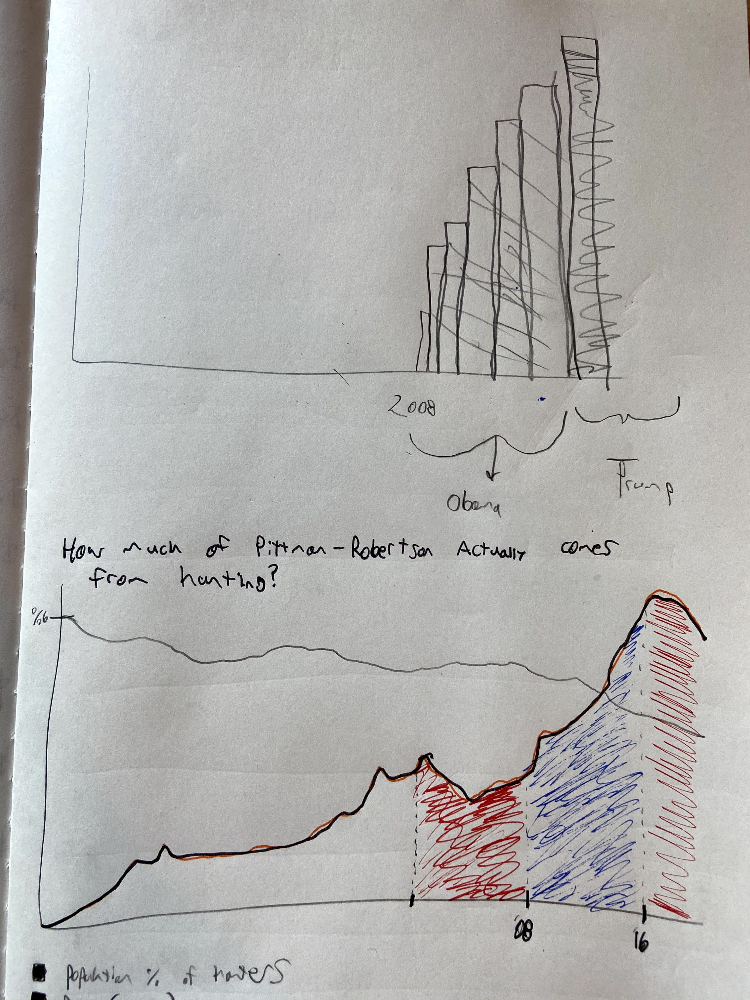

# Week 4?

### **Data Sources:**

- [https://fas.org/sgp/crs/misc/R45667.pdf](https://fas.org/sgp/crs/misc/R45667.pdf)
- [https://fas.org/sgp/crs/misc/R45123.pdf](https://fas.org/sgp/crs/misc/R45123.pdf)
- [https://catalog.data.gov/dataset/firearms-and-ammunition-excise-tax-faet-collections-which-are-broken-out-between-handguns-](https://catalog.data.gov/dataset/firearms-and-ammunition-excise-tax-faet-collections-which-are-broken-out-between-handguns-)
- [https://www.southwickassociates.com/breaking-down-excise-taxes-on-firearms-and-ammunition/](https://www.southwickassociates.com/breaking-down-excise-taxes-on-firearms-and-ammunition/)
- [https://www.wvpublic.org/post/decline-hunters-threatens-how-us-pays-conservation#stream/0](https://www.wvpublic.org/post/decline-hunters-threatens-how-us-pays-conservation#stream/0)
- [https://www.nps.gov/aboutus/upload/FY-2018-NPS-Greenbook.pdf](https://www.nps.gov/aboutus/upload/FY-2018-NPS-Greenbook.pdf)
- [https://www.perc.org/2019/05/28/how-we-pay-to-play-funding-outdoor-recreation-on-public-lands-in-the-21st-century/](https://www.perc.org/2019/05/28/how-we-pay-to-play-funding-outdoor-recreation-on-public-lands-in-the-21st-century/)
- [https://www.americanhunter.org/articles/2020/7/9/covid-19-spurs-conservation-funding-with-gun-ammo-sales/](https://www.americanhunter.org/articles/2020/7/9/covid-19-spurs-conservation-funding-with-gun-ammo-sales/)
- [https://www.outdoorlife.com/why-we-are-losing-hunters-and-how-to-fix-it/](https://www.outdoorlife.com/why-we-are-losing-hunters-and-how-to-fix-it/)
- [https://www.npr.org/2018/03/20/593001800/decline-in-hunters-threatens-how-u-s-pays-for-conservation](https://www.npr.org/2018/03/20/593001800/decline-in-hunters-threatens-how-u-s-pays-for-conservation)

## **My Focus for This Assignment:**

I picked these visualizations as I am a frequent user of the outdoors but don't really understand where funding comes from for places like national parks and wildlife refuges. I have often heard people say things about how 'hunters pay for all of the US conservation' and wanted to find out more about if this is really the case and in what capacity.

**For the assignment, I have chosen to focus on Figure 3, as I feel there is a story to be told that is missing from the current graphic.**

- [https://fas.org/sgp/crs/misc/R45667.pdf](https://fas.org/sgp/crs/misc/R45667.pdf)

    - Figure 3. Pittman-Robertson Wildlife Restoration Act Total Apportionments,
    FY1939-FY2019 (top), and Apportionments by Program, FY2015-FY2019 (bottom)
        - Source: CRS, data from U.S. Fish and Wildlife Service, Wildlife and Sport Fish Restoration Program, 1939through 2019 WR Apportionments (includes Hunter Ed), at
        https://wsfrprograms.fws.gov/Subpages/GrantPrograms/WR/WRApportionmentsHE-1939-2019.xlsx.

A separate set of visualizations that I felt also, while very solid, could be improved for the aspect of telling a better story.

- Figure 2. Pittman-Robertson Revenues from Ammunition, Firearms, Pistols and
Revolvers, and Archery Equipment, FY2007-FY2016

## Initial Critic

- I think the raw bar chart combined with the inflation adjusted dollars helps with the truthfulness of the graph
- Congress is the primary audience and my understanding is that they want to what congress understands about a topic. I think the visualization is informative for the audience but I am not sure what specifically it is trying to communicate the congress

## Wire Frame

## User Feedback

- **Can you tell me what you think this is?**
    - **User one** (Girlfriend *terribly biased to like my work)*
        - Showing funding from pittman act but with overlay of last two administrations
    - **User two** (Brother *terribly biased to dislike my work)*
        - Not quite sure since you are missing a title and labels, besides something about Obama and trump
- **Can you describe to me what this is telling you?**
    - **User one** (Girlfriend *terribly biased to like my work)*
        - Funding for conservation went up during a democratic reign?
    - **User two** (Brother *terribly biased to dislike my work)*
        - Democrats traditionally are more environmentally concerned and this chart show how much they expanded funding for conservation
- **Is there anything you find surprising or confusing?**
    - **User one** (Girlfriend *terribly biased to like my work)*
        - The size of the spike? There were democrats in office before so the spike seems extreme
    - **User two** (Brother *terribly biased to dislike my work)*
        - Size of the spike? what is driving this?
- **Who do you think is the intended audience for this?**
    - **User one** (Girlfriend *terribly biased to like my work)*
        - People interested in conservation?
    - **User two** (Brother *terribly biased to dislike my work)*
        - people who dislike trump?
- **Is there anything you would change or do differently?**
    - **User one** (Girlfriend *terribly biased to like my work)*
        - More information about the spike and decline?
    - **User two** (Brother *terribly biased to dislike my work)*
        - Add labels you jagoff

## Prototype

I wanted to make sure I could get the data in good enough shape for putting into a visualization so I made a quick tableau workbook to play around with the data some and I was able to reproduce the original graph. 

<noscript></noscript><object class='tableauViz' style='display:none;'><param name='host_url' value='https%3A%2F%[2Fpublic.tableau.com](http://2fpublic.tableau.com/)%2F' /> <param name='embed_code_version' value='3' /> <param name='site_root' value='' /><param name='name' value='Pittman-RobertsanAppropriations/Sheet1' /><param name='tabs' value='no' /><param name='toolbar' value='yes' /><param name='static_image' value='[https://public.tableau.com/static/images/Pi/Pittman-RobertsanAppropriations/Sheet1/1.png](https://public.tableau.com/static/images/Pi/Pittman-RobertsanAppropriations/Sheet1/1.png)' /> <param name='animate_transition' value='yes' /><param name='display_static_image' value='yes' /><param name='display_spinner' value='yes' /><param name='display_overlay' value='yes' /><param name='display_count' value='yes' /><param name='language' value='en' /><param name='filter' value='publish=yes' /></object>
 

As Tableau can be somewhat strict on what you can and cannot do with the images, I decided to also just do a second freehand drawing of the graph as it currently exists in my head which is included below:

## Process

**Critique Method**

I really enjoyed this critique method and found it be my favorite of the other frameworks and methods we've looked at. I found that it has most helped me review a chart better from a 'what story am I trying to tell?' standpoint. For myself the ideas of usefulness and completeness help push a designer to tell a better story while other parts of the index such as perceptibility, truthfulness, and intuitiveness keep a designer honest in representing the data and striving for clarity in that representation.

**Wire framing/Prototyping**

I find the process of using pen and paper, despite my limited artistic capabilities, a great way to explore different ideas of a visualization when you want to do more complex and nuanced representations of the data (similar to the auto death example provided in the HW) faster then using a digital tool which are great for broad EDA (for example R).

**Building the Solution**

In building the solution I wanted to play around with Tableau more but I think for the story I have in mind for the image might need to be achieved in a different manner (hoping to explore using the R Graphics Cookbook to determine if that will be a viable route).

**Story in Mind**

Despite declining numbers in hunters, the excise tax appropriations from Robert-Pittman rose substantially during the Obama administration(most likely explained by gun sales driven by fear of stricter gun laws), and that the decline (less fearful of stricter gun laws) during the Trump administration makes aspect like a Backpack Tax possibly good solutions to sustaining conservation funding while also advancing more progressive gun control.
